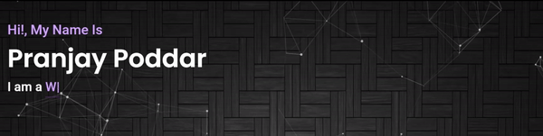

<h3>Hello Folks!👋</h3>
  
  

&nbsp;&nbsp;
&nbsp;&nbsp;

  
### About Me: :octocat:

 I love making websites and Apps.I'am passionate for open source development, web development, web designing and graphic designing.

### My Digital Garden:🌱

#### Blog Posts:🚀
I write blog posts, most of which you will find on my [personal website](https://pranjay-poddar.github.io/portfolio/index.html) and on [medium](https://medium.com/data-science-community-srm/the-transition-from-graphic-design-to-ui-ux-design-c5a24f795be5?source=friends_link&sk=236622b1fa3ba4f19e2687845b2daa39).

#### Channels:📺
I have a youtube channel [Catalytic Originals](https://www.youtube.com/catalyticoriginals) 

 
<strong>Links to Channels</strong>

 
 
 #### Official Tenor-GIF Creator:
[Tenor Page](https://tenor.com/official/pranjay_poddar) 

💌 Sign up for my channel's [website](https://pranjay-poddar.github.io/catalytic_originals/signup/index.html)

<h4>See Ya!💥  And Stay Awesome!📢</h4>
<h4>Check out my repositories 👇 and get in touch for collaboration.💻⭐☎️
    

